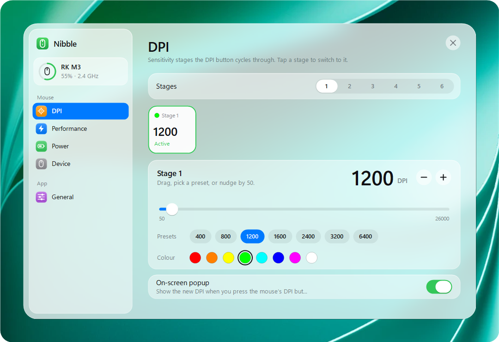
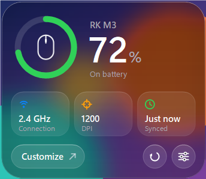
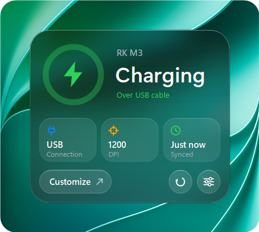
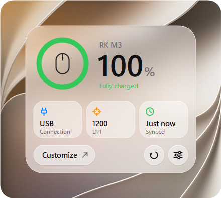
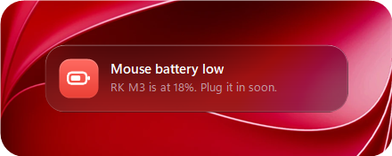
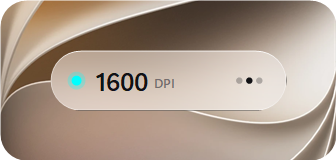
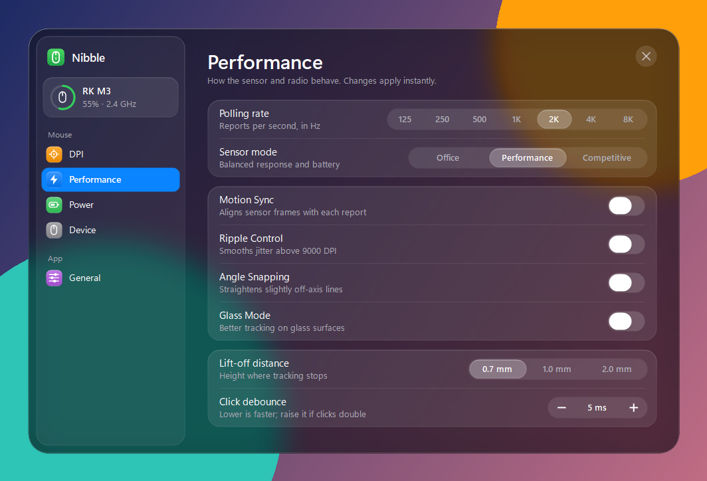
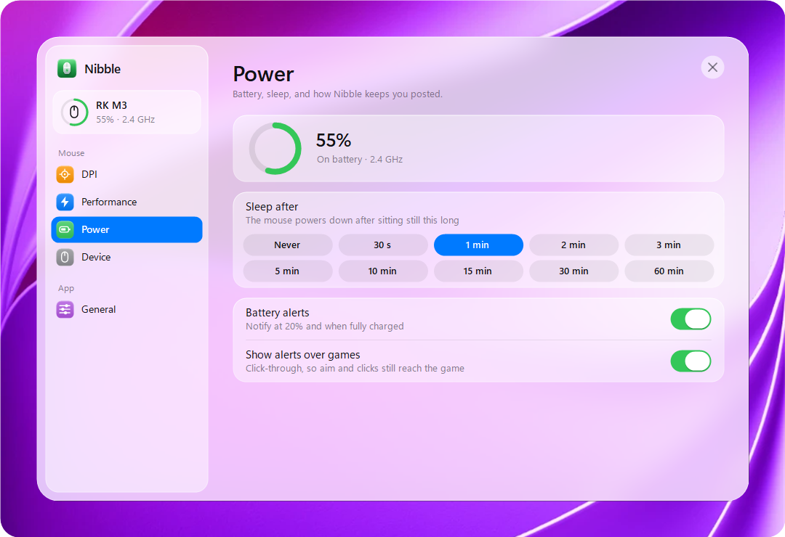
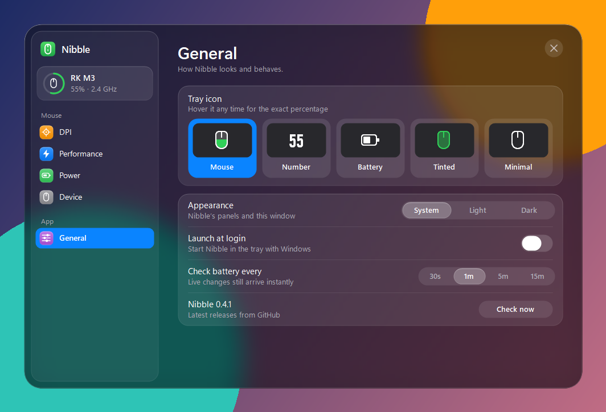
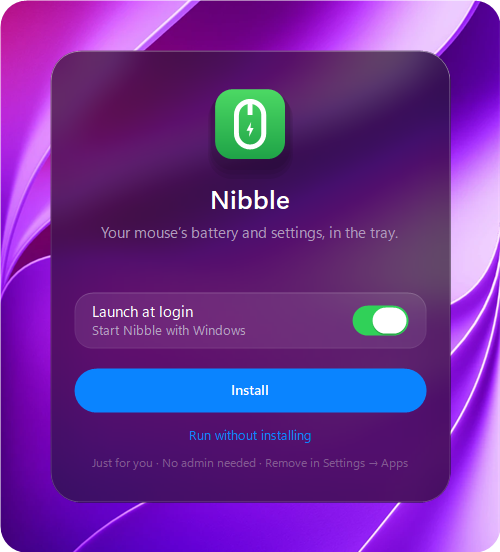

# Nibble

A tiny Windows tray app for the **Royal Kludge M3** mouse: battery at a glance, and every setting the RK web driver has, without the browser.

<p align="center">
  
</p>
<p align="center">
  
  
  
</p>
<p align="center">
  
  
</p>

<details>
<summary>More screenshots</summary>

<p align="center">
  
  
  
  
</p>

</details>

<sub>Screenshot backdrops are Apple’s iOS wallpapers, used for illustration only.</sub>

- **Tray icon.** Five styles (fill-up mouse, number, battery, tinted, minimal), drawn with Segoe Fluent Icons so they match the system icons. Hover for the exact percentage.
- **Flyout.** Click the icon for a glass panel with the battery ring, connection, DPI and last sync.
- **Settings.** DPI stages with LED colours, polling rate (125 Hz to 8 kHz), sensor mode, Motion Sync, ripple control, angle snapping, glass mode, lift-off distance, debounce and sleep timer. Everything is read from and written to the mouse directly.
- **DPI popup.** Shows the new DPI when you press the mouse's DPI button. It's click-through, so it's safe mid-game.
- **Alerts.** At 20% and when fully charged. They can show click-through over borderless games and wait out exclusive fullscreen.
- **Firmware check.** Compares installed firmware with RK's published versions and links to RK's updater. Nibble never flashes firmware itself.
- **Light.** One ~150 KB exe on the .NET Framework that ships with Windows. About 1 MB working set when idle, and no work between checks.

> Not affiliated with Royal Kludge. "RK" and "Royal Kludge" are their trademarks.

## Install

Download `Nibble.exe` from [Releases](https://github.com/shanuflash/nibble/releases) and run it. It offers to install itself:

- **Install** copies it to `%LOCALAPPDATA%\Programs\Nibble`, adds it to the Start menu and to Settings → Apps, and optionally launches it at login. No admin rights needed.
- **Just run it** keeps it portable, running from wherever it is.

To update, download the new version and run it; it replaces the installed one and keeps your settings. Nibble checks for its own updates in Settings → General. To remove it, uninstall it from Settings → Apps.

## Build

```
build.cmd
```

This builds `bin\Nibble.exe` with the C# compiler included in Windows; nothing else to install. `NIBBLE_VERSION` sets the version.

To release, run **Actions → Build → Run workflow** with a version and tick **release**. The workflow only runs manually.

## Project layout

```
src/
  App/            entry point, tray wiring, mouse session, preferences, alerts, installer, update check
  Devices/        device-neutral model: IMouse, MouseSettings, MouseCaps, Drivers
    RoyalKludge/  RK protocol (RkLink), M3 settings table, firmware check, M3 driver
  Platform/       HID, HTTP and shell interop
  UI/             theme, glass, glass card windows and their control kit, icons, flyout, install card
    Popups/       notification and DPI popup
    Settings/     settings window, one file per page
```

The UI only talks to `IMouse` and reads `MouseCaps` to decide which options to show.

### Adding a mouse

1. Implement `IMouse` in `src/Devices/<Vendor>/`. It covers status, reading and writing settings, factory reset, firmware check and the event stream. For other RK mice, `RkLink` probably already speaks the protocol.
2. Describe what the mouse supports in its `MouseCaps`: polling rates, DPI range, stage count, LED colours, sleep options, tuning toggles.
3. Add the driver to `Drivers.All`.

### Dev flags

- `--show` opens the flyout, `--settings` opens the settings window, and `--portable` skips the install card.
- `--snapshot out.png dark|light [percent] [charging|asleep|full] [settings]` renders the flyout to a PNG.
- `--snapshot-settings out.png dark|light <page> [charging]` renders a settings page.
- `--snapshot-install out.png dark|light install|update|installed|uninstall [busy|done|error]` renders the install card.

- `--snapshot-toast out.png dark|light [full]` and `--snapshot-dpi out.png dark|light` render the popups.
- Add `--bg image.png` to any snapshot to render it over that image instead of the plain backdrop.

The screenshots in `docs/screenshots` are made with these flags. The wallpapers aren’t in the repo.
- `--test-dpi-hud` and `--test-notifications` show the popups.

## How it talks to the M3

The receiver is VID `0x372E`, PID `0x1019` (`0x102A` over the cable). Commands are 64-byte HID feature reports (ID 3) on usage page `0xFF00`:

```
request  [03][crc][50][len][sn][cmd][offset][payload…]   crc = sum(bytes 2..62) & 0xFF
reply    [03][50][status][len][sn][offset][data…]        each reply can be read once
```

| cmd | what |
|---|---|
| `4F` read | Offset `0x81` is status (battery = `data[0] & 0x7F`, bit 7 = charging). Offsets `0x40`–`0x45` hold the 56-byte settings table in 10-byte chunks. |
| `35` write | Config bytes at an offset: polling rate (1), lift-off/debounce/tuning bits (3), sleep (8). |
| `3A` write | One DPI stage: `[stage<<4 \| count, dpi_lo, dpi_hi, r, g, b]`. DPI is stored as `dpi/50 − 1` up to 30000. |
| `06` | Factory reset. |

The firmware version uses the OTA frame family (`0x65 … 0x92`). Live events arrive on usage page `0xFF06` as input report 9, `09 FA <type> <value>`: type 2 is link, 3 is DPI stage and 5 is battery.

All of this was worked out from drive.rkgaming.com's JavaScript and checked against a real M3.

## Privacy

Nibble will not transfer any information to other networked systems unless you ask it to. It talks to the mouse over USB and makes two network requests, both only when you open the page that shows the result:

- Settings → Device fetches RK's firmware manifest from drive.rkgaming.com.
- Settings → General asks GitHub for Nibble's latest release ([GitHub's privacy statement](https://docs.github.com/en/site-policy/privacy-policies/github-general-privacy-statement)).

Neither request sends anything about you or your mouse.

## License

[MIT](LICENSE)
