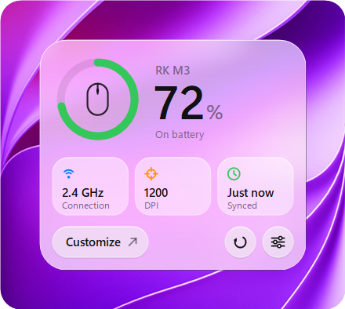
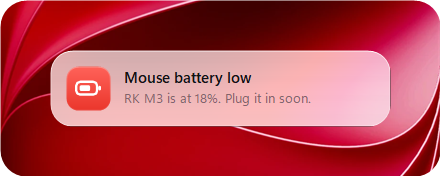
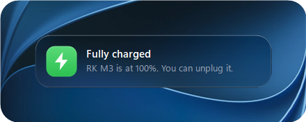

# Nibble

Battery and settings for the Royal Kludge M3, in your Windows tray.

  

  
  

  
  

  

More screenshots

  
  
  
  

A tray app that replaces RK's web driver, in a single 167 KB exe.

## Features

- Battery level in the tray, with five icon styles
- DPI stages with LED colours, and a popup when you press the DPI button
- Polling rate up to 8 kHz, sensor mode, Motion Sync, angle snapping, lift-off distance, debounce and sleep timer
- Alerts at 20% and when fully charged, which don't interrupt games
- Firmware check against RK's latest version
- Light and dark mode

## Lightweight

Measured on Windows 11, as shown in Task Manager:

| | Memory | CPU |
|---|---|---|
| Idle in the tray | 0.3 MB | 0% |
| Flyout open | 4 MB | |
| Settings open | 16 MB | |

Panels free their memory as soon as they close, so Nibble drops back to 0.3 MB.

## Install

Download `Nibble.exe` from [Releases](https://github.com/shanuflash/nibble/releases) and run it. It installs for your account only, so no admin rights are needed, and can start with Windows.

To update, run a newer version. To uninstall, go to Settings → Apps.

Nibble isn't code-signed, so Windows may say it doesn't recognise the app. Click **More info**, then **Run anyway**.

## Build

Run `build.cmd`. It uses the C# compiler that comes with Windows, so there's nothing to install, and writes `bin\Nibble.exe`.

## Adding a mouse

Each mouse is one driver in `src/Devices`. Implement `IMouse`, list what the mouse supports in `MouseCaps`, and add it to `Drivers.All`. The settings pages only show what the mouse supports.

## Privacy

Nibble only goes online when you open two settings pages. Device checks RK's server for firmware updates, and General checks GitHub for new versions of Nibble. Nothing about you or your mouse is sent.

## License

[MIT](LICENSE). Not affiliated with Royal Kludge. Screenshot backgrounds are Apple wallpapers.
